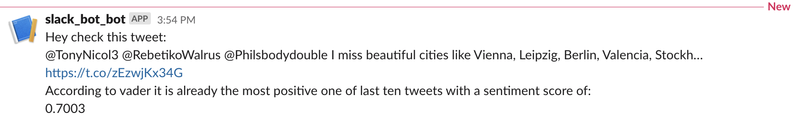

# tweet_posting_slackbot
Docker compose project : Twitter api -> Mongoldb -> ETL -> Postgresql -> Slack bot post

## Goal : 
- get latest 10 tweets through twitter api
- do sentiment analysis using vadar sentiment analyzer 
- post most positive tweet and corresponding sentiment score on slack via a slackbot 
## Techstack : 
- Python(Tweepy, request, pymongo, vaderSentiment, sqlalchemy, pandas)
- Docker 
- Mongo
- Postgresql
## Structure : 
- docker composer with five containers
    - tweet_collector 
        - get tweets from twitter api write into mongodb container
    - mongodb container
    - etl container 
        - extract : extract tweets from mongodb container
        - transform : perform sentiment analysis with vader
        - load : load tweets and corresponding sentiment score into postgresdb container
    - postgresdb container
    - slackbot container 
        - get tweets and scores from postgresdb container
        - select the most positive one 
        - post on slack 
## Requirements :
- need API_KEY, API_SECRET, ACCESS_TOKEN, ACCESS_TOKEN_SECRET from twitter developer portal : https://developer.twitter.com/en/portal/dashboard
- need webhook from slack api app webpage https://api.slack.com/apps 
## Results : 

RERERENCE :
- spiced academy course material

